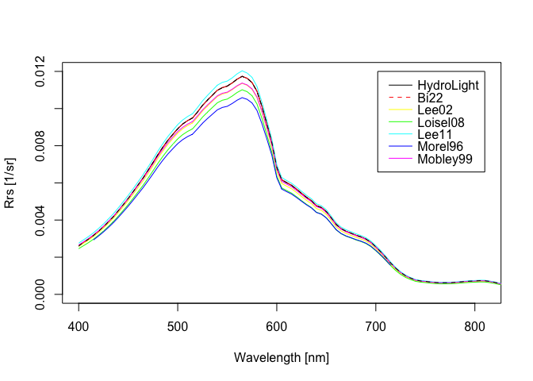

<!-- README.md is generated from README.Rmd. Please edit that file -->

# RrsTrans

<!-- badges: start -->

[](https://lifecycle.r-lib.org/articles/stages.html#experimental)
<!-- badges: end -->

The R package `RrsTrans` is created as an appendix of our recent study
entitled “A transfer model to determine the above-water remote-sensing
reflectance from the underwater remote-sensing ratio” by Bi et
al. (202x). `RrsTrans` includes six models: one from the paper above,
Lee et al. (2002), Mobely (1999), Loisel (2008), Lee et al. (2011), and
Morel and Gentili (1996).

## Installation

You can install the development version of RrsTrans like so:

``` r
remotes::install_github("bishun945/RrsTrans")
```

## Online tool

A `shiny`-based online tool has been added to this package. Please refer
it via the link:

<https://bishun945.shinyapps.io/RrsTransShinny/>

## Example

This is a basic example which shows you how to run the models in our
package:

``` r
library(RrsTrans)
library(data.table)
data("demo_spec")

# parameters preparation
wavelen  = demo_spec[Theta == 40, wavelen]
rrs      = demo_spec[Theta == 40, rrs_nadir]
Rrs      = demo_spec[Theta == 40, Rrs]
at       = demo_spec[Theta == 40, at]
bbt      = demo_spec[Theta == 40, bbt]
bbw      = demo_spec[Theta == 40, bbw]
suntheta = 59.90437
Theta    = 40
Phi      = 135
windspd  = 6
cloud    = 0
Temp     = 1.1
Sal      = 31.1

# run models
nw = WOPP(Temp, Sal, wavelen)$nw
Rrs_Lee02 = trans_Lee02(rrs)
Rrs_Loisel08 = trans_Loisel08(rrs, suntheta)
Rrs_Lee11 = trans_Lee11(at, bbt, bbw, Theta, Phi, suntheta)
Rrs_Bi22 = trans_Bi22(rrs, Theta, Phi, suntheta, windspd, cloud, nw = nw)
Rrs_Mobley99 = trans_Mobley99(rrs)
Rrs_Morel96 = trans_Morel96(rrs, wavelen, Theta, suntheta)

# plot
pal_col = rainbow(n=6)
plot(wavelen, Rrs, col = "black", type = "l",
     xlim = c(400, 810), ylim = c(0, 0.012),
     xlab = "Wavelength [nm]", ylab = "Rrs [1/sr]")
lines(wavelen, Rrs_Bi22, col = pal_col[1], type = "l")
lines(wavelen, Rrs_Lee02, col = pal_col[2], type = "l")
lines(wavelen, Rrs_Loisel08, col = pal_col[3], type = "l")
lines(wavelen, Rrs_Lee11, col = pal_col[4], type = "l")
lines(wavelen, Rrs_Morel96, col = pal_col[5], type = "l")
lines(wavelen, Rrs_Mobley99, col = pal_col[6], type = "l")
lines(wavelen, Rrs, col = "black", type = "l", lty = 2)
legend(x = 810, y = 0.012, xjust = 1, yjust = 1,
       c("HydroLight", "Bi22", "Lee02", "Loisel08",
         "Lee11", "Morel96", "Mobley99"),
       col = c("black", pal_col), lty = c(1, 2, rep(1, 5)),
       x.intersp = 0.5, y.intersp = 0.8)
```



# References

-   Lee, ZhongPing, Kendall L. Carder, and Robert A. Arnone. “Deriving
    Inherent Optical Properties from Water Color: A Multiband
    Quasi-Analytical Algorithm for Optically Deep Waters.” Applied
    Optics 41, no. 27 (September 20, 2002): 5755.
    <https://doi.org/10.1364/AO.41.005755>.

-   Lee, Zhongping, Keping Du, Kenneth J. Voss, Giuseppe Zibordi,
    Bertrand Lubac, Robert Arnone, and Alan Weidemann. “An
    Inherent-Optical-Property-Centered Approach to Correct the Angular
    Effects in Water-Leaving Radiance.” Applied Optics 50, no. 19 (July
    1, 2011): 3155. <https://doi.org/10.1364/AO.50.003155>.

-   Loisel, Hubert. “Rrs(0+) -\> Rrs(0-) & Water Coefficients.” Ocean
    Color Forum, Inherent OPtical Properties Workshop, 2008.
    <http://oceancolor.gsfc.nasa.gov/forum/oceancolor/topic_show.pl?tid=2657>.

-   Mobley, Curtis D. “Estimation of the Remote-Sensing Reflectance from
    above-Surface Measurements.” Applied Optics 38, no. 36 (December 20,
    1999): 7442. <https://doi.org/10.1364/AO.38.007442>.

-   Morel, André, and Bernard Gentili. “Diffuse Reflectance of Oceanic
    Waters III Implication of Bidirectionality for the Remote-Sensing
    Problem.” Applied Optics 35, no. 24 (August 20, 1996): 4850.
    <https://doi.org/10.1364/AO.35.004850>.

-   Röttgers, R, R Doerffer, D McKee, and W Schönfeld. “The Water
    Optical Properties Processor (WOPP): Pure Water Spectral Absorption,
    Scattering and Real Part of Refractive Index Model.” Technical
    Report No WOPP-ATBD/WRD6, 2016.
    <https://calvalportal.ceos.org/tools>.
